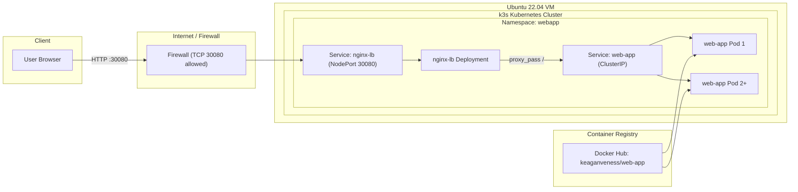

# Systems Engineer Technical Assessment

## 1. Introduction

This repository contains a containerized web application, deployed on a lightweight Kubernetes distribution (k3s) and fronted by an NGINX load balancer with basic caching and security controls.

The goal of this project is to demonstrate:

* Automated provisioning of a server
* Containerization of the application
* An orchestrated, scalable deployment
* Load balancing and caching at the edge
* Practical security hardening
* Clear documentation and reproducible steps

Everything in this repo works end-to-end against a fresh `Ubuntu 22.04` server.

You can see a live demo here: http://demo.keaganveness.com:30080

## 2. Repository Structure

```
├── README.md
├── provision.sh
├── deploy.sh
├── destroy.sh
├── .github/
│   └── workflows/
│       └── docker-build.yaml
├── app/
│   ├── index.js
│   └── Dockerfile
└── k8s/
    ├── namespace.yaml
    ├── app-deployment.yaml
    ├── app-service.yaml
    ├── nginx-configmap.yaml
    ├── nginx-deployment.yaml
    └── nginx-service.yaml
```

## 3. Architecture Overview



### 1) The Web Application

A simple Node.js HTTP server (provided in the assessment) that returns:

* The container hostname -> to demonstrate loadbalancing
* The server time -> to demonstrate caching

It runs inside Kubernetes as the `web-app` deployment using a ClusterIP service.

### 2) The k3s Kubernetes Cluster

A lightweight Kubernetes distribution. This is installed by the provisioning script (`provision.sh`) on the target server. k3s provides:

* Deployment scaling
* Pod restarts and health checks
* Service discovery
* Cluster networking 

### 3) The NGINX Load Balancer

This runs inside Kubernetes as the `nginx-lb` deployment and is exposed using a NodePort service on port `30080`. 

Nginx provides:

* Reverse proxying to the web-app service
* Load balancing across multiple web-app replicas
* Caching of HTML responses (with a 10 second TTL)
* Basic HTTP security headers

The deployment script (`deploy.sh`) installs the necessary Kubernetes manifests for the web application and NGINX load balancer.

## 4. Prerequisites

You will need a Linux server (it can be bare metal/VM/cloud) running:

* Ubuntu 22.04+
* Minimum specs: 1 vCPU, 1GB RAM, 20GB disk
* Recommended specs: 2 vCPUs, 2GB RAM, 20GB disk
* Outbound internet access
* Sudo privileges

This deployment has been tested on an AWS Lightsail instance with 2vCPUs, 2GB RAM, 30GB disk.

## 5. Building the Image

I already built and published the image publically to my DockerHub repository at:

```
keaganveness/web-app:latest
```

The `web-app` deployment manifest references this already, so it will work as is, but if you want to create the image yourself you can do the following:

```
cd app
docker build -t <your-dockerhub-user>/web-app:latest .
docker push <your-dockerhub-user>/web-app:latest
```

Then update the image field in the `web-app` deployment manifest.

## 6. Provision the Server

Run the provisioning script from inside the repo's root to install k3s and configure kubectl:

```
chmod +x provision.sh
sudo ./provision.sh
```

Reload your shell or run:

```
source /etc/profile.d/k3s-kubectl.sh
```

Verify that the cluster is up and running:

```
kubectl get nodes
```

You should see one node in a `Ready` state.

## 7. Deploy the Application Stack

Run the deploy script from inside the repo's root:

```
chmod +x deploy.sh
./deploy.sh
```

This applies the Kubernetes manifests for:

* The `web-app` namespace
* The `web-app` deployment and service
* The `nginx-lb` deployment and service

Verify that everything is up and running:

```
kubectl -n webapp get pods,svc
```

You should see the following:

* A single `web-app-*` pod.
* A single `nginx-lb-*` pod.
* A ClusterIP `web-app` service.
* A NodePort `nginx-lb` service on port `30080`.

## 8. Accessing the Application

Ensure TCP port 30080 is open on your firewall.

You can then visit:

```
http://<server-public-ip>:30080/
```

## 9. Scaling the Deployment and Verifying Load Balancing

To scale the web application, you can run the following:

```
kubectl -n webapp scale deploy/web-app --replicas=3
```

If you refresh the page multiple times, you should see different pod names serving the response. This confirms that NGINX is load balancing your requests across the web app replicas.

You can also scale the NGINX load balancer with the following:

```
kubectl -n webapp scale deploy/nginx-lb --replicas=2
```

However this is not necessary for this assessment and can intefere with the 10 second refresh test to validate caching. Each NGINX pod maintains its own cache, so you can get different response states depending on which pod handles the request.

## 10. Security Controls

### Application Pod Security

I added `securityContext` and related config to the `web-app` pods to achieve the following:

* The pods run as **non-root**
* The pods have a read-only root filesystem
* Privilege escalation is disabled
* k8s does not auto-mount a service account token as this application does not need to speak to the api server
* Setting resource requests/limits and liveness/readiness probes (general app health)

The above follow the principle of **least privilege** access and ensure the application runs with only the permissions it needs.

### Network Exposure

Network exposure is tightly restricted:

* The `web-app` service is ClusterIP (internal only)
* Only the `nginx-lb` NodePort service is exposed externally on port `30080`.
* The firewall should only have the required ports open. In AWS I have just opened port 30080.

### NGINX Hardening

I added the following lightweight security controls to NGINX:

* Disabled NGINX server version exposure (`server_tokens off`) so attackers can't easily see it
* Added standard security headers (`X-Frame-Options`, `X-Content-Type-Options`, `X-XSS-Protection`)
* Limited request body size to 1MB (`client_max_body_size 1m`) since this app doesn't handle uploads. This reduces the risk of large-body abuse or accidental huge requests.
* Ensure only the `/` path is proxied to the backend to prevent accident access to internal or unintended paths (if there were ones other than the NGINX defaults)

## 11. CI Workflow

I've included a very simple GitHub Actions workflow that runs automatically on every push to main. It performs two basic checks:

* Validates the syntax of the Node.js application
* Builds the Docker image to ensure the Dockerfile is correct

## 12. Cleanup

To remove all Kubernetes resources, you can run the destroy script from the repo's root:

```
chmod +x destroy.sh
./destroy.sh
```

## 12. Future Improvements

With more time, I would add the following:

* TLS termination via cert-manager and Let's Encrypt
* Horizontal Pod Autoscaling (HPA) based on CPU/RPS
* NGINX rate limiting or WAF rules
* GitOps driven deployments using Helm and ArgoCD
* Kubernetes NetworkPolicies to restrict pod-to-pod communication
* Centralised logging + dashboard with Prometheus and Grafana

## 13. Conclusion

This project demonstrates a practical, production-minded approach to running a containerized web application. I've kept the design intentionally simple and transparent so that each componenent can be easily reviewed and reproduced.